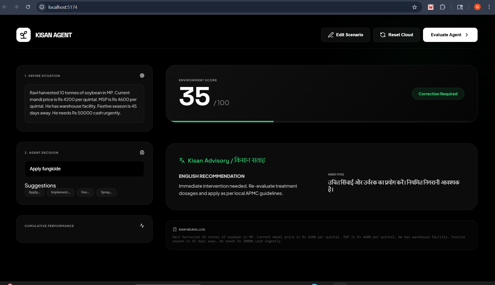

# 🌾 KisanAgent — Multi-Agent AI Environment for Farmer Decision Support

## 🚜 Problem

Over **600 million farmers in India** make critical decisions every day:

* What disease is affecting crops?
* What treatment to apply?
* When to irrigate?
* When to sell?

One wrong decision can result in **entire season loss**.

---

## 🤖 Solution

“I developed **KisanAgent** — a **multi-agent AI environment** where agents learn to make **reliable farming decisions** using **verifiable rewards and feedback loops**.

This is **not just a chatbot** — it is a **decision-making environment**.

---

## 🧠 System Architecture

```
Environment → Agents → Evaluation → Reward → Improvement
```

### 🔹 Agents:

* **DiagnosisAgent** → Identifies crop disease
* **AdvisoryAgent** → Recommends treatment, fertilizer, irrigation
* **Evaluator / Grader** → Scores output and generates feedback

---

## 🔁 Learning Behavior

The system improves over episodes using feedback:

```
Episode 1 → Score: 0.4  
Episode 2 → Score: 0.6  
Episode 3 → Score: 0.8  
Episode 5 → Score: 0.9+
```

👉 Demonstrates **learning over time**, not static output.

---

## 🎯 Key Features

* ✅ Multi-Agent Architecture
* ✅ Verifiable Reward System (0.0 – 1.0 scoring)
* ✅ Feedback Loop for Improvement
* ✅ Realistic Indian Farming Scenarios
* ✅ Bilingual Output (English + Hindi 🇮🇳)
* ✅ OpenEnv-Compatible API
* ✅ Deployable via Docker + HuggingFace

---

## 🌍 Example Output

```json
{
  "diagnosis": {
    "disease": "Bacterial Leaf Blight",
    "confidence": 0.85,
    "severity": "medium"
  },
  "explanation": "For your crop rice, the issue is bacterial leaf blight...",
  "hindi_advice": "Aapki fasal mein bacterial leaf blight ki samasya hai..."
}
```

---

## ⚙️ API Endpoints

| Endpoint  | Method | Description         |
| --------- | ------ | ------------------- |
| `/reset`  | POST   | Initialize scenario |
| `/step`   | POST   | Run agent decision  |
| `/state`  | POST   | Get current state   |
| `/health` | GET    | Health check        |

---

## 🧪 Training (Colab)

We simulate training using multiple episodes:

👉 **Colab Notebook:** *(https://colab.research.google.com/drive/1O37wZRD7FbnpZ-nLcJsOFLwKj52Dlb8t?usp=sharing)*

---

## 🚀 Live Demo

👉 **HuggingFace Space:** *(https://nile-2026-kisanagent-env.hf.space/docs)*

---

---

## 🖥️ Frontend Demo

We built an interactive frontend interface for real-time agent evaluation.

It allows users to:

- Enter farming scenarios  
- Get AI-generated decisions  
- View reward score (0–100)  
- See bilingual recommendations (English + Hindi 🇮🇳)  

This transforms the system into a **complete product**, not just an API.

### 📸 Screenshot



---

## 🐳 Deployment

This project is fully containerized using Docker:

```bash
docker build -t kisanagent .
docker run -p 7860:7860 kisanagent
```

---

## 📂 Project Structure

```
kisanagent-env/
├── server/
│   ├── agents/
│   ├── tasks/
│   ├── graders/
│   ├── data/
│   ├── env.py
│   ├── main.py
│   └── models.py
├── inference.py
├── train.py
├── Dockerfile
├── requirements.txt
└── openenv.yaml
```

---

## 🔥 Why This Matters

* Moves beyond chatbots → **decision systems**
* Uses **structured rewards instead of subjective answers**
* Designed for **real-world agricultural impact**

---

## 📈 Future Scope

* Integration with weather APIs
* Satellite-based crop monitoring
* Market price prediction
* Voice-based farmer interaction

---

## 👨‍💻 Developer

**Nilesh Gupta**
Final Year Engineering Student
AI + Generative AI Enthusiast

---

## 🏁 Conclusion

**KisanAgent transforms AI from generating responses to learning reliable decisions.**

👉 When the agent improves, the farmer benefits.

---
